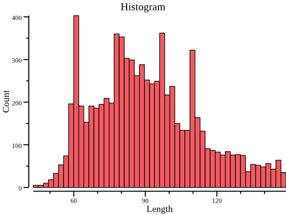
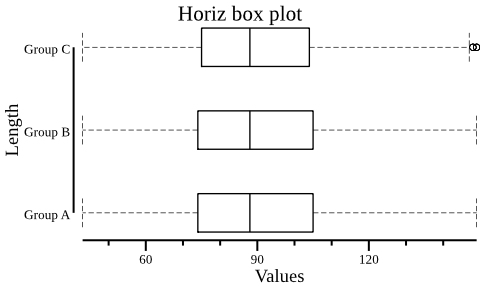
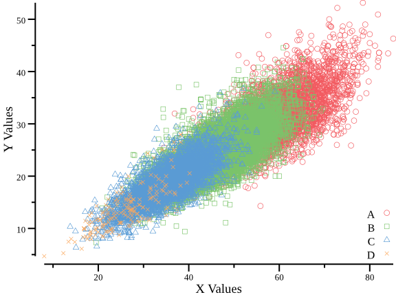

# csvtk - a cross-platform, efficient, practical and pretty CSV/TSV toolkit

- **Documents:** [http://bioinf.shenwei.me/csvtk](http://bioinf.shenwei.me/csvtk/)
( [**Usage**](http://bioinf.shenwei.me/csvtk/usage/)  and [**Tutorial**](http://bioinf.shenwei.me/csvtk/tutorial/))
- **Source code:**  [https://github.com/shenwei356/csvtk](https://github.com/shenwei356/csvtk) 

- **Latest version:** 

## Introduction

Similar to FASTA/Q format in field of Bioinformatics,
CSV/TSV formats are basic and ubiquitous file formats in both Bioinformatics and data sicence.

People usually use spreadsheet softwares like MS Excel to do process table data.
However it's all by clicking and typing, which is **not
automatically and time-consuming to repeat**, especially when we want to
apply similar operations with different datasets or purposes.

***You can also accomplish some CSV/TSV manipulations using shell commands,
but more codes are needed to handle the header line. Shell commands do not
support selecting columns with column names either.***

`csvtk` is **convenient for rapid data investigation
and also easy to be integrated into analysis pipelines**.
It could save you much time of writing Python/R scripts.

## Table of Contents

<!-- START doctoc generated TOC please keep comment here to allow auto update -->
<!-- DON'T EDIT THIS SECTION, INSTEAD RE-RUN doctoc TO UPDATE -->

- [Features](#features)
- [Subcommands](#subcommands)
- [Installation](#installation)
- [Compared to `csvkit`](#compared-to-csvkit)
- [Examples](#examples)
- [Acknowledgements](#acknowledgements)
- [Contact](#contact)
- [License](#license)

<!-- END doctoc generated TOC please keep comment here to allow auto update -->

## Features

- **Cross-platform** (Linux/Windows/Mac OS X/OpenBSD/FreeBSD)
- **Light weight and out-of-the-box, no dependencies, no compilation, no configuration**
- **Fast**,  **multiple-CPUs supported**
- **Practical functions supported by N subcommands**
- **Support STDIN and gziped input/output file, easy being used in pipe**
- Most of the subcommands support ***unselecting fields*** and ***fuzzy fields***,
  e.g. `-f "-id,-name"` for all fields except "id" and "name",
  `-F -f "a.*"` for all fields with prefix "a.".
- **Support common plots** (see [usage](http://bioinf.shenwei.me/csvtk/usage/#plot))
- Seamlessly support for data with meta line (e.g., `sep=,`) of separator declaration used by MS Excel

## Subcommands

25 subcommands in total.

**Information**

-  `headers` print headers
-  `stats` summary of CSV file
-  `stats2` summary of selected digital fields

**Format conversion**

-  `pretty` convert CSV to readable aligned table
-  `csv2tab` convert CSV to tabular format
-  `tab2csv` convert tabular format to CSV
-  `space2tab` convert space delimited format to CSV
-  `transpose` transpose CSV data
-  `csv2md` convert CSV to markdown format

**Set operations**

-  `head` print first N records
-  `sample` sampling by proportion
-  `cut` select parts of fields
-  `uniq` unique data without sorting
-  `freq` frequencies of selected fields
-  `inter` intersection of multiple files
-  `grep` grep data by selected fields with patterns/regular expressions
-  `filter` filter rows by values of selected fields with artithmetic expression
-  `filter2` filter rows by awk-like artithmetic/string expressions
-  `join` join multiple CSV files by selected fields

**Edit**

-  `rename` rename column names
-  `rename2` rename column names by regular expression
-  `replace` replace data of selected fields by regular expression
-  `mutate` create new columns from selected fields by regular expression

**Ordering**

-  `sort` sort by selected fields

**Ploting**

- `plot` see [usage](http://bioinf.shenwei.me/csvtk/usage/#plot)
    - `plot hist` histogram
    - `plot box` boxplot
    - `plot line` line plot and scatter plot

## Installation

[Download Page](https://github.com/shenwei356/csvtk/releases)

`csvtk` is implemented in [Go](https://golang.org/) programming language,
 executable binary files **for most popular operating systems** are freely available
  in [release](https://github.com/shenwei356/csvtk/releases) page.

#### Method 1: Download binaries

Just [download](https://github.com/shenwei356/csvtk/releases) compressed
executable file of your operating system,
and decompress it with `tar -zxvf *.tar.gz` command or other tools.
And then:

1. **For Linux-like systems**
    1. If you have root privilege simply copy it to `/usr/local/bin`:

            sudo cp csvtk /usr/local/bin/

    1. Or add the current directory of the executable file to environment variable
    `PATH`:

            echo export PATH=\$PATH:\"$(pwd)\" >> ~/.bashrc
            source ~/.bashrc

1. **For windows**, just copy `csvtk.exe` to `C:\WINDOWS\system32`.

#### Method 2: Install via conda   

    conda install -c bioconda csvtk

#### Method 3: For Go developer

    go get -u github.com/shenwei356/csvtk/csvtk

## Compared to `csvkit`

[csvkit](http://csvkit.readthedocs.org/)

Features                |  csvtk   |  csvkit   |   Note
:-----------------------|:--------:|:---------:|:---------
Read    Gzip            |   Yes    |  Yes      | read gzip files
Fields ranges           |   Yes    |  Yes      | e.g. `-f 1-4,6`
**Unselect fileds**     |   Yes    |  --       | e.g. `-1` for excluding first column
**Fuzzy fields**        |   Yes    |  --       | e.g. `ab*` for columns with name prefix "ab"
Reorder fields          |   Yes    |  Yes      | it means `-f 1,2` is different from `-f 2,1`
**Rename columns**      |   Yes    |  --       | rename with new name(s) or from existed names
Sort by multiple keys   |   Yes    |  Yes      | bash sort like operations
**Sort by number**      |   Yes    |  --       | e.g. `-k 1:n`
**Multiple sort**       |   Yes    |  --       | e.g. `-k 2:r -k 1:nr`
Pretty output           |   Yes    |  Yes      | convert CSV to readable aligned table
**unique rows**         |   Yes    |  --       | unique data of selected fields
**freqency of rows**    |   Yes    |  --       | frequencies of selected fields
**sampling**            |   Yes    |  --       | sampling by proportion
**mutate fields**       |   Yes    |  --       | create new columns from selected fields
**repalce**             |   Yes    |  --       | replace data of selected fields 

Similar tools:

- [csvkit](http://csvkit.readthedocs.org/) - A suite of utilities for converting to and working with CSV, the king of tabular file formats. http://csvkit.rtfd.org/
- [xsv](https://github.com/BurntSushi/xsv) - A fast CSV toolkit written in Rust.
- [miller](https://github.com/johnkerl/miller) - Miller is like sed, awk, cut, join, and sort for
name-indexed data such as CSV and tabular JSON http://johnkerl.org/miller
- [tsv-utils-dlang](https://github.com/eBay/tsv-utils-dlang) - Command line utilities for tab-separated value files written in the D programming language.

## Examples

More [examples](http://shenwei356.github.io/csvtk/usage/) and [tutorial](http://shenwei356.github.io/csvtk/tutorial/).

**Attention**

1. The CSV parser requires all the lines have same number of fields/columns.
    Even lines with spaces will cause error.
2. By default, csvtk thinks your files have header row, if not, switch flag `-H` on.
3. Column names better be unique.
4. By default, lines starting with `#` will be ignored, if the header row
    starts with `#`, please assign flag `-C` another rare symbol, e.g. `'$'`.
5. By default, csvtk handles CSV files, use flag `-t` for tab-delimited files.
6. If `"` exists in tab-delimited files, use flag `-l`.

Examples

1. Pretty result

        $ csvtk pretty names.csv
        id   first_name   last_name   username
        11   Rob          Pike        rob
        2    Ken          Thompson    ken
        4    Robert       Griesemer   gri
        1    Robert       Thompson    abc
        NA   Robert       Abel        123

1. Summary of selected digital fields: num, sum, min, max, mean, stdev (`stat2`)

        $ cat digitals.tsv
        4       5       6
        1       2       3
        7       8       0
        8       1,000   4

        $ cat digitals.tsv | csvtk stat2 -t -H -f 1-3
        field   num     sum   min     max     mean    stdev
        1         4      20     1       8        5     3.16
        2         4   1,015     2   1,000   253.75   497.51
        3         4      13     0       6     3.25      2.5

1. Select fields/columns (`cut`)

    - By index: `csvtk cut -f 1,2`
    - By names: `csvtk cut -f first_name,username`
    - **Unselect**: `csvtk cut -f -1,-2` or `csvtk cut -f -first_name`
    - **Fuzzy fields**: `csvtk cut -F -f "*_name,username"`
    - Field ranges: `csvtk cut -f 2-4` for column 2,3,4 or `csvtk cut -f -3--1` for discarding column 1,2,3
    - All fields: `csvtk cut -F -f "*"`

1. Search by selected fields (`grep`) (matched parts will be highlighted as red)

    - By exactly matching: `csvtk grep -f first_name -p Robert -p Rob`
    - By regular expression: `csvtk grep -f first_name -r -p Rob`
    - By pattern list: `csvtk grep -f first_name -P name_list.txt`
    - Remore rows containing missing data (NA): `csvtk grep -F -f "*" -r -p "^$" -v `

1. Rename column names (`rename` and `rename2`)

    - Setting new names: `csvtk rename -f A,B -n a,b` or `csvtk rename -f 1-3 -n a,b,c`
    - Replacing with original names by regular express: `cat ../testdata/c.csv | ./csvtk rename2 -F -f "*" -p "(.*)" -r 'prefix_$1'` for adding prefix to all column names.

1. Edit data with regular expression (`replace`)

    - Remove Chinese charactors:  `csvtk replace -F -f "*_name" -p "\p{Han}+" -r ""`

1. Create new column from selected fields by regular expression (`mutate`)

    - In default, copy a column: `csvtk mutate -f id `
    - Extract prefix of data as group name (get "A" from "A.1" as group name):
      `csvtk mutate -f sample -n group -p "^(.+?)\."`

1. Sort by multiple keys (`sort`)

    - By single column : `csvtk sort -k 1` or `csvtk sort -k last_name`
    - By multiple columns: `csvtk sort -k 1,2` or `csvtk sort -k 1 -k 2` or `csvtk sort -k last_name,age`
    - Sort by number: `csvtk sort -k 1:n` or  `csvtk sort -k 1:nr` for reverse number
    - Complex sort: `csvtk sort -k region -k age:n -k id:nr`

1. Join multiple files by keys (`join`)

    - All files have same key column: `csvtk join -f id file1.csv file2.csv`
    - Files have different key columns: `csvtk join -f "username;username;name" names.csv phone.csv adress.csv -k`

1. Filter by numbers (`filter`)

    - single field: `csvtk filter -f "id>0"`
    - multiple fields: `csvtk filter -f "1-3>0"`
    - using `--any` to print record if any of the field satisfy the condition: `csvtk filter -f "1-3>0" --any`
    - fuzzy fields: `csvtk filter -F -f "A*!=0"`

1. ploting
    - plot histogram with data of the second column:
     `csvtk -t plot hist testdata/grouped_data.tsv.gz -f 2`
    
    - plot boxplot with data of the "GC Content" (third) column,
    group information is the "Group" column.
    `csvtk -t plot box testdata/grouped_data.tsv.gz -g "Group" -f "GC Content"  --width 3`
    
    -  plot horiz boxplot with data of the "Length" (second) column,
    group information is the "Group" column.
    `csvtk -t plot box testdata/grouped_data.tsv.gz -g "Group" -f "Length"  --height 3 --width 5 --horiz --title "Horiz box plot"`
    
    - plot line plot with X-Y data
    `csvtk -t plot line testdata/xy.tsv -x X -y Y -g Group`
    
    - plot scatter plot with X-Y data
    `csvtk -t plot line testdata/xy.tsv -x X -y Y -g Group --scatter `
    

## Acknowledgements

We are grateful to [Zhiluo Deng](https://github.com/dawnmy) and
[Li Peng](https://github.com/penglbio) for suggesting features and reporting bugs.

## Contact

Email me for any problem when using `csvtk`. shenwei356(at)gmail.com

Or [create an issue](https://github.com/shenwei356/csvtk/issues) to report bugs,
propose new functions or ask for help.

Or [leave a comment](https://shenwei356.github.io/csvtk/usage/#disqus_thread).

## License

[MIT License](https://github.com/shenwei356/csvtk/blob/master/LICENSE)
